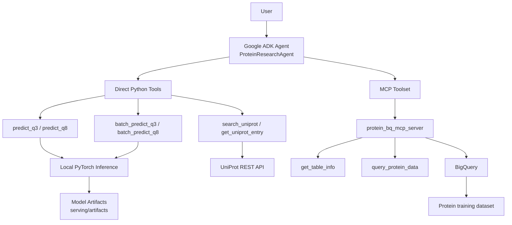

# Protein AI Research Assistant

Protein AI Research Assistant is a domain-specific AI agent for protein sequence exploration, secondary-structure prediction, UniProt annotation lookup, and training-dataset analysis.

The project started as a PyTorch LSTM-based protein secondary-structure prediction system. It now combines:

- local Q3 and Q8 prediction tools backed by trained PyTorch checkpoints,
- a FastAPI inference service for standalone serving,
- a Google ADK agent for conversational workflows,
- UniProt REST API tools for biological lookup,
- a custom MCP server for guarded BigQuery access.

This is not a general autonomous scientist. It is a focused protein research assistant that can chain retrieval, prediction, and dataset analysis in one workflow.

## Current Scope

The assistant can currently:

- predict Q3 secondary structure for one sequence,
- predict Q8 secondary structure for one sequence,
- run batch Q3 and Q8 predictions,
- search UniProt for candidate protein entries,
- retrieve a UniProt entry with sequence, function annotations, GO terms, and keywords,
- compare a protein against the training dataset through BigQuery,
- combine retrieved facts and model predictions in one natural-language response.

Example workflow:

1. search UniProt for a reviewed human protein,
2. retrieve the protein sequence and functional annotations,
3. compare sequence length to the training dataset average,
4. run Q3 or Q8 prediction locally,
5. return a concise interpretation with confidence caveats.

## Architecture



Supporting components:

- `serving/`: FastAPI app and model-serving code
- `Protein_agent/`: ADK agent, prediction tools, UniProt tools, prompt, and internal schemas
- `protein_bq_mcp_server/`: MCP server exposing read-only BigQuery operations
- `protein_model/`: shared training/model code
- `scripts/`: training and analysis utilities

## Model Performance

Published benchmark results from the sequence-modeling work:

| Dataset | Q3 Accuracy | Q8 Accuracy |
|---------|-------------|-------------|
| CB513   | 76.2%       | 62.1%       |
| TS115   | 75.8%       | 61.7%       |
| CASP12  | 74.9%       | 60.3%       |

These scores reflect the trained sequence models, not end-to-end agent quality.

## Repository Layout

```text
protein_struct_proj/
├── Protein_agent/
│   ├── agent.py
│   ├── agent-prompt.md
│   ├── tools.py
│   ├── uniprot_tools.py
│   └── schemas.py
├── protein_bq_mcp_server/
│   └── server.py
├── protein_model/
│   ├── architecture.py
│   ├── data_utils.py
│   └── preprocess_training.py
├── serving/
│   ├── app/
│   │   ├── main.py
│   │   ├── model.py
│   │   ├── preprocess.py
│   │   └── schemas.py
│   └── artifacts/
├── scripts/
│   ├── train.py
│   ├── plots.py
│   └── queries/
├── dataset/
├── Dockerfile
├── requirements.txt
└── README.md
```

## Installation

### Prerequisites

- Python 3.11 recommended
- Docker, if you want to run the FastAPI container
- Google Cloud credentials, if you want BigQuery MCP access

### Setup

```bash
git clone https://github.com/Mubarak-11/Protein_Secondary_Strucuture_Prediction.git protein_struct_proj
cd protein_struct_proj
pip install -r requirements.txt
```

If you are using a local virtual environment, activate it before installing dependencies.

## Running the FastAPI Service

Local development:

```bash
uvicorn serving.app.main:app --reload
```

Docker:

```bash
docker build -t protein-serving .
docker run -p 8000:8000 protein-serving
```

Available endpoints:

- `GET /health`
- `POST /predict/q3`
- `POST /predict/q8`
- `POST /predict/batch_q3`
- `POST /predict/batch_q8`

Example:

```bash
curl -X POST http://localhost:8000/predict/q3 \
  -H "Content-Type: application/json" \
  -d '{"sequence": "MVLSPADKTNVKAAW"}'
```

## Running the ADK Agent

The agent uses:

- local PyTorch prediction tools,
- UniProt REST lookups,
- an MCP server for BigQuery access.

Before running the agent, make sure the required environment and credentials are available for:

- Google ADK,
- BigQuery access,
- local model artifacts in `serving/artifacts/`.

Typical local flow:

```bash
cd protein_struct_proj
# activate your virtual environment first
# then start the ADK development workflow using Protein_agent/agent.py
```

The exact launch command may vary with your local ADK setup, but the root agent is defined in `Protein_agent/agent.py`.

The agent is currently intended for local development and demo workflows rather than public production deployment.

## UniProt and BigQuery Workflows

Recent improvements include:

- richer UniProt entry retrieval with function annotations, GO terms, and keywords,
- richer UniProt search results with reviewed-entry metadata,
- grouped prediction regions for Q3 and Q8 outputs,
- prompt updates that better separate retrieved facts from model predictions.

This means the agent can now answer prompts such as:

- “Find the reviewed UniProt entry for human myoglobin and summarize its function.”
- “Compare this protein’s length to the average length in the training dataset.”
- “Predict Q3 for the UniProt sequence and summarize the major structural regions.”

## Current Progress

Implemented and working locally:

- trained Q3 and Q8 PyTorch checkpoints,
- FastAPI serving path,
- ADK agent with local prediction tools,
- MCP BigQuery integration,
- UniProt search and entry lookup,
- structured prediction regions for cleaner agent summaries,
- internal Pydantic schemas that reflect tool output contracts.

Not yet done:

- public deployment of the ADK agent,
- tighter canonical-entry ranking for ambiguous UniProt searches,
- richer biological fields such as domains or subcellular location,
- evaluation harnesses for systematic agent benchmarking,
- polished public repo/demo assets.

## Future Iterations

Planned next steps include:

- improve UniProt candidate selection and ranking behavior,
- expand biological annotations and protein metadata retrieval,
- add better formatting or smoothing for structural region summaries,
- improve evaluation and observability for agent responses,
- add semantic protein search and retrieval workflows,
- explore mutation analysis and structure-impact experiments,
- prepare a cleaner public demo and repository presentation.

## Caveats

- Prediction confidence is a model confidence score, not a calibrated biological probability.
- The sequence models can disagree with known structural biology, especially when tertiary context matters.
- BigQuery access is guarded for development use, but the current MCP guardrails are not a full public security boundary.

## License

This project is licensed under the MIT License.
