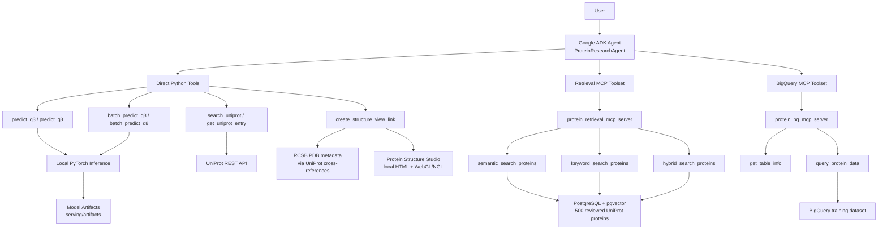
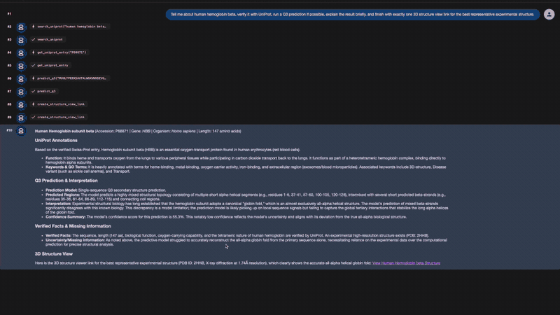

بِسْمِ اللَّهِ الرَّحْمَٰنِ الرَّحِيمِ


All praise and thanks are due to Allah.
 
# Protein AI Research Assistant


**Retrieval-grounded protein research agent** — curated UniProt corpus, hybrid vector + lexical retrieval, verified annotations, local PyTorch Q3/Q8 prediction, and a verified 3D structure handoff.

Protein AI Research Assistant is a domain-specific research agent for protein sequence exploration, UniProt annotation lookup, local protein retrieval, training-dataset analysis, secondary-structure prediction, and 3D structure-view handoff.

The project started as a PyTorch LSTM system for Q3/Q8 secondary-structure prediction. It is now a retrieval-grounded agent workflow that can:

- find candidate proteins from a local reviewed UniProt corpus,
- verify selected accessions through UniProt,
- compare proteins against the training dataset through BigQuery,
- run local Q3/Q8 structure prediction when the sequence is within model limits,
- resolve experimental PDB structures and generate Protein Structure Studio viewer links,
- produce answers that separate verified facts, interpretation, uncertainty, and missing information.

This is not a general autonomous scientist. It is a focused protein research assistant built to demonstrate reliable, tool-grounded biological workflows.

## Table of Contents

- [Scientific Question](#scientific-question)
- [What The Agent Can Do](#what-the-agent-can-do)
- [Architecture](#architecture)
- [Retrieval Corpus](#retrieval-corpus)
- [Retrieval Tools](#retrieval-tools)
- [Why The 100-Query Benchmark Exists](#why-the-100-query-benchmark-exists)
- [Retrieval Evaluation](#retrieval-evaluation)
- [Reliability Contract](#reliability-contract)
- [Demo Reliability Hardening](#demo-reliability-hardening)
- [Secondary-Structure Model Performance](#secondary-structure-model-performance)
- [Setup](#setup)
- [Running The Retrieval Pipeline](#running-the-retrieval-pipeline)
- [Running The FastAPI Service](#running-the-fastapi-service)
- [Running The ADK Agent](#running-the-adk-agent)
- [Tests](#tests)
- [Repository Layout](#repository-layout)
- [Limitations](#limitations)
- [Why Not Scale To Thousands Yet?](#why-not-scale-to-thousands-yet)
- [Grand Finale: Agent → Protein Structure Studio](#grand-finale-agent--protein-structure-studio)
- [Post-V1 Direction](#post-v1-direction)
- [License](#license)

## Scientific Question

Can a protein-focused AI assistant combine retrieval, verified biological annotations, dataset statistics, and local sequence prediction into answers that are useful and scientifically cautious?

The V1 answer is yes, within a clear scope:

- retrieval finds strong candidate proteins from a curated local corpus,
- UniProt verification prevents retrieval candidates from becoming unsupported claims,
- prediction is limited to sequences up to 512 residues,
- reliability tests catch tool failures and ambiguity before they become silent agent failures.

## What The Agent Can Do

The assistant currently supports:

- semantic, keyword, and hybrid protein retrieval over a local PostgreSQL + pgvector corpus,
- UniProt search and accession lookup,
- Q3 secondary-structure prediction,
- Q8 secondary-structure prediction,
- batch Q3/Q8 prediction,
- read-only BigQuery analysis of the secondary-structure training dataset,
- PDB-backed structure-view link generation for Protein Structure Studio,
- multi-step workflows combining retrieval, UniProt lookup, dataset comparison, prediction, and 3D visualization handoff.

Example workflow:

1. User asks for DNA repair proteins relevant to human disease.
2. Agent runs hybrid retrieval over the local protein corpus.
3. Agent selects a candidate accession and explains why.
4. Agent verifies the selected protein in UniProt.
5. Agent compares sequence length or sequence presence against the training dataset.
6. Agent predicts Q3/Q8 only if the sequence is valid and no longer than 512 residues.
7. Agent resolves an experimental PDB structure when available.
8. Agent returns a final answer with verified facts, interpretation, uncertainty, missing information, and a Structure Studio link.

## Architecture


```mermaid
flowchart TD
    U["User"] --> A["Google ADK Agent<br/>ProteinResearchAgent"]

    A --> PT["Direct Python Tools"]
    PT --> Q3["predict_q3 / predict_q8"]
    PT --> BQ3["batch_predict_q3 / batch_predict_q8"]
    PT --> UNI["search_uniprot / get_uniprot_entry"]
    PT --> VIEW["create_structure_view_link"]

    Q3 --> INF["Local PyTorch Inference"]
    BQ3 --> INF
    INF --> ART["Model Artifacts<br/>serving/artifacts"]

    UNI --> UR["UniProt REST API"]
    VIEW --> PDB["RCSB PDB metadata<br/>via UniProt cross-references"]
    VIEW --> STUDIO["Protein Structure Studio<br/>local HTML + WebGL/NGL"]

    A --> RMCP["Retrieval MCP Toolset"]
    RMCP --> RS["protein_retrieval_mcp_server"]
    RS --> SEM["semantic_search_proteins"]
    RS --> KEY["keyword_search_proteins"]
    RS --> HYB["hybrid_search_proteins"]
    SEM --> PG["PostgreSQL + pgvector<br/>500 reviewed UniProt proteins"]
    KEY --> PG
    HYB --> PG

    A --> BMCP["BigQuery MCP Toolset"]
    BMCP --> BQS["protein_bq_mcp_server"]
    BQS --> GT["get_table_info"]
    BQS --> QT["query_protein_data"]
    QT --> BQ["BigQuery training dataset"]
```

Core packages:

- `Protein_agent/`: ADK agent, prompt, prediction tools, UniProt tools, structure-view tool, reliability contract.
- `protein_retrieval/`: reusable retrieval config, DB access, embeddings, search, service, UniProt normalization.
- `protein_retrieval_mcp_server/`: MCP server exposing semantic, keyword, and hybrid retrieval tools.
- `protein_bq_mcp_server/`: MCP server exposing guarded read-only BigQuery tools.
- `protein_structure_view/`: reusable payload, PDB cross-reference parsing, and Structure Studio URL generation.
- `serving/`: FastAPI prediction service.
- `protein_model/`: model and preprocessing utilities.
- `scripts/rag/`: thin wrappers for fetch, ingest, embed, search, warmup, and evaluation.
- `benchmarks/`: retrieval benchmark queries.

## Retrieval Corpus

The local retrieval corpus contains 500 curated, reviewed UniProtKB/Swiss-Prot entries.

The seed accession list is the source of truth:

```text
dataset/uniprot_seed_accessions.txt
```

The fetched UniProt JSONL is generated from that source:

```text
dataset/uniprot_seed_jsonl
```

The corpus is intentionally curated rather than randomly sampled. The goal is to include proteins that are nameable, gene-queryable, and useful in realistic agent prompts.

Current organism distribution:

| Organism | Count |
|----------|------:|
| Homo sapiens | 272 |
| Saccharomyces cerevisiae | 53 |
| Arabidopsis thaliana | 37 |
| Escherichia coli K12 | 35 |
| Drosophila melanogaster | 26 |
| Caenorhabditis elegans | 21 |
| Danio rerio | 13 |
| Oryza sativa japonica | 13 |
| Gallus gallus | 11 |
| HIV-1 HXB2 | 7 |
| Other reviewed organisms / viral or toxin entries | 12 |

Final corpus invariants:

```text
total proteins: 500
reviewed entries: 500
embedded entries: 500
embedding model: BAAI/bge-small-en-v1.5
embedding dimensions: 384
```

## Retrieval Tools

The retrieval MCP server exposes three tools:

- `semantic_search_proteins`: BGE embedding search over pgvector.
- `keyword_search_proteins`: PostgreSQL full-text search for exact lexical matches.
- `hybrid_search_proteins`: weighted reciprocal-rank fusion of semantic and keyword search.

Hybrid search is the default for discovery-style questions. Keyword search remains useful for exact gene symbols, accessions, and aliases. Semantic search is strong for descriptive biological prompts.

The default hybrid settings are:

```text
vector_weight = 1.0
keyword_weight = 0.1
rrf_k = 60
```

## Why The 100-Query Benchmark Exists

The retrieval benchmark is not just for a metrics table. It is a rehearsal environment for the agent.

The agent usually makes an early decision from retrieval: choose a candidate accession, verify it with UniProt, then continue to dataset analysis or prediction. That means retrieval quality directly affects downstream answer quality.

The benchmark checks whether the retrieval layer can handle:

- exact UniProt accessions,
- exact gene symbols,
- canonical protein names,
- descriptive biological functions,
- disease and pathway phrasing,
- organism-specific prompts,
- cross-organism homologs,
- aliases and small-molecule target phrasing,
- multi-relevant protein families,
- deliberate no-result traps.

The benchmark now has:

```text
100 total queries
95 positive-labeled queries
5 no-result negative queries
74 multi-relevant queries
260 unique positive UniProt labels
```

All positive labels were verified against UniProt and checked against the local 500-protein database.

No-result queries have empty `relevant_accessions` and are excluded from metric averages. They are still printed during evaluation so failure behavior can be inspected manually.

## Retrieval Evaluation

Evaluation command:

```bash
python -m scripts.rag.evaluate_retrieval
```

Results on the 500-protein corpus and 100-query benchmark:

| Method | Precision@5 | Recall@10 | MRR |
|--------|-------------|-----------|-----|
| Vector | 0.522 | 0.946 | 0.902 |
| Keyword | 0.099 | 0.241 | 0.274 |
| Hybrid | 0.531 | 0.948 | 0.913 |

The expanded benchmark is harder than the original 15-query snapshot because it includes real cross-organism homolog distractors. For example, a query about p53, EGFR, actin, tubulin, heat shock proteins, or DNA repair can now retrieve related proteins from human, yeast, plants, fly, worm, fish, chicken, bacteria, or viruses.

The important result is that hybrid retrieval still leads after the benchmark became more realistic:

- Recall@10 = 0.948, so relevant proteins are almost always kept within reach.
- MRR = 0.913, so a relevant protein is usually ranked first or very close to first.
- Precision@5 = 0.531, which is meaningful because most benchmark rows now have multiple valid relevant accessions.

This matters for the agent because the first retrieved candidate is often the protein the agent verifies and acts on next.

## Reliability Contract

The agent prompt requires substantive protein answers to include:

- accession when known,
- selection rationale when a protein is chosen from candidates,
- evidence/review status when available,
- verified facts,
- interpretation,
- uncertainty,
- missing information.

The reliability scenarios are defined in:

```text
Protein_agent/reliability.py
```

The current scenario set covers:

- ambiguous queries,
- invalid accessions,
- no-result queries,
- wrong-organism temptations,
- long-sequence prediction limits,
- tool/API failure.

This reliability pattern caught a real hidden bug: invalid UniProt accessions caused `requests.raise_for_status()` to raise inside `get_uniprot_entry`, which made the ADK agent return an empty response. The fix was to make UniProt tools return graceful failure dictionaries instead of raising transport or HTTP errors into the agent runtime.

Example graceful failure:

```python
{
    "accession": "NOT_A_REAL_ACCESSION",
    "ok": False,
    "error": "UniProt lookup failed (HTTP 400): the requested information could not be verified."
}
```

That lets the agent satisfy the contract: report the failed lookup, avoid fabrication, and list missing protein identity, organism, sequence, function, GO terms, and keywords.

## Demo Reliability Hardening

The demo runtime includes several reliability hardening steps:

- The ADK agent defaults to `gemini-3.1-pro-preview` for richer tool routing.
- The retrieval MCP server warms the BGE embedding model before serving tool calls.
- BGE loading uses `local_files_only=True` by default to avoid Hugging Face HEAD-request latency in the first tool call.
- Hugging Face, transformers, and sentence-transformers logging noise is reduced.
- MCP retrieval tools return stable success and error envelopes.
- UniProt tool failures return graceful dictionaries instead of crashing the agent.

Useful runtime knobs:

```bash
PROTEIN_AGENT_MODEL=gemini-3.1-pro-preview
PROTEIN_RETRIEVAL_LOCAL_FILES_ONLY=true
PROTEIN_RETRIEVAL_MCP_WARMUP=true
```

Warm retrieval model manually:

```bash
python -m scripts.rag.warm_retrieval
```

Expected output:

```text
Warmed embedding model: BAAI/bge-small-en-v1.5
Embedding dimensions: 384
```

## Secondary-Structure Model Performance

The local prediction tools use trained PyTorch checkpoints for Q3 and Q8 secondary-structure prediction.

| Dataset | Q3 Accuracy | Q8 Accuracy |
|---------|-------------|-------------|
| CB513 | 76.2% | 62.1% |
| TS115 | 75.8% | 61.7% |
| CASP12 | 74.9% | 60.3% |

These are sequence-model benchmark scores, not end-to-end agent scores.

Prediction limits:

- valid amino acids only: `A C D E F G H I K L M N P Q R S T V W Y`,
- maximum prediction length: 512 residues,
- proteins longer than 512 residues are summarized but not predicted.

For example, the agent correctly refuses Q3 prediction for human BRCA1 because UniProt reports BRCA1 as 1,863 amino acids, above the 512-residue model limit.

## Setup

Python 3.11 is recommended.

```bash
git clone https://github.com/Mubarak-11/Protein-AI-Research-Assistant.git
cd Protein-AI-Research-Assistant
python -m venv .venv
source .venv/bin/activate
pip install -r requirements.txt
```

> **Developer note (not required for public setup):** during local development this
> project was built inside a shared ML virtualenv at `~/.venvs/ml311/`. If you reuse
> that environment on this machine, activate it instead of the fresh `.venv` above:
>
> ```bash
> source ~/.venvs/ml311/bin/activate
> ```

## Running The Retrieval Pipeline

The retrieval pipeline uses thin scripts around reusable package logic.

Fetch reviewed UniProt records:

```bash
python -m scripts.rag.fetch_uniprot \
  --accessions dataset/uniprot_seed_accessions.txt \
  --out dataset/uniprot_seed_jsonl
```

Ingest normalized metadata into PostgreSQL:

```bash
python -m scripts.rag.ingest_uniprot_metadata \
  --jsonl dataset/uniprot_seed_jsonl
```

Embed unembedded rows:

```bash
python -m scripts.rag.embed_proteins --limit 500
```

Run search wrappers:

```bash
python -m scripts.rag.keyword_search "TP53"
python -m scripts.rag.vector_search "DNA repair homologous recombination"
python -m scripts.rag.hybrid_search "human DNA repair proteins"
```

Run the retrieval benchmark:

```bash
python -m scripts.rag.evaluate_retrieval
```

## Running The FastAPI Service

Local development:

```bash
uvicorn serving.app.main:app --reload
```

Docker:

```bash
docker build -t protein-serving .
docker run -p 8000:8000 protein-serving
```

Available endpoints:

- `GET /health`
- `POST /predict/q3`
- `POST /predict/q8`
- `POST /predict/batch_q3`
- `POST /predict/batch_q8`

Example:

```bash
curl -X POST http://localhost:8000/predict/q3 \
  -H "Content-Type: application/json" \
  -d '{"sequence": "MVLSPADKTNVKAAW"}'
```

## Running The ADK Agent

The ADK root agent is defined in:

```text
Protein_agent/agent.py
```

It wires:

- local prediction tools,
- UniProt tools,
- BigQuery MCP toolset,
- retrieval MCP toolset.

Before running the agent, make sure the required local services and credentials are available:

- PostgreSQL database `protein_rag`,
- populated `proteins` table with pgvector embeddings,
- Google ADK credentials,
- BigQuery credentials for dataset analysis,
- local PyTorch model artifacts in `serving/artifacts/`.

The exact ADK launch command may vary by local setup, but the root agent is `ProteinResearchAgent`.

## Tests

Run the unit tests:

```bash
python -m unittest discover tests
```

Current test coverage includes:

- reliability scenario contract,
- prompt contract checks,
- retrieval MCP success/error envelopes,
- retrieval top-k clamping,
- runtime hardening defaults,
- UniProt graceful failure behavior,
- Structure Studio payload encoding, PDB selection, and agent tool behavior,
- regression coverage for the compact-UniProt-entry structure handoff.

Current status: **35 tests, all passing**. Run them with the project interpreter, for
example `/Users/mubarak/.venvs/ml311/bin/python -m unittest discover tests` during local
development, or plain `python -m unittest discover tests` inside an activated venv.

## Repository Layout

```text
protein_struct_proj/
├── Protein_agent/
│   ├── agent.py
│   ├── agent-prompt.md
│   ├── config.py
│   ├── reliability.py
│   ├── structure_tools.py
│   ├── tools.py
│   ├── uniprot_tools.py
│   └── schemas.py
├── benchmarks/
│   └── retrieval_queries.jsonl
├── dataset/
│   └── uniprot_seed_accessions.txt
├── docs/
│   ├── agent_structure_handoff.gif
│   └── structure_studio_handoff.md
├── protein_bq_mcp_server/
│   └── server.py
├── protein_retrieval/
│   ├── config.py
│   ├── db.py
│   ├── embeddings.py
│   ├── runtime.py
│   ├── search.py
│   ├── service.py
│   └── uniprot.py
├── protein_retrieval_mcp_server/
│   └── server.py
├── protein_structure_view/
│   ├── links.py
│   ├── models.py
│   ├── payload.py
│   ├── pdb_mapping.py
│   └── uniprot.py
├── protein_model/
├── scripts/
│   ├── rag/
│   └── reliability/
├── serving/
├── tests/
├── Dockerfile
├── requirements.txt
└── README.md
```

## Limitations

- The retrieval corpus is curated and intentionally small at 500 reviewed proteins. It is designed for reliable V1 demos, not exhaustive proteome coverage.
- Retrieval results are candidates, not biological truth. The agent verifies selected proteins with UniProt before making detailed claims.
- The 100-query benchmark is a practical agent-retrieval benchmark, not a broad IR benchmark over all of UniProt.
- No-result queries are inspected but excluded from metric averages because precision/recall over empty relevance sets are not meaningful.
- Q3/Q8 prediction is limited to sequences up to 512 residues.
- Prediction confidence is a model confidence score, not a calibrated probability of biological correctness.
- The sequence model can miss tertiary, quaternary, ligand-binding, and membrane-context effects.
- Structure visualization depends on an available PDB mapping and the local Protein Structure Studio server.
- BigQuery MCP guardrails are for local/demo use and are not a complete public security boundary.

## Why Not Scale To Thousands Yet?

For V1, a larger random corpus would mostly add labeling burden and noisy failure modes. The current 500-protein corpus is curated, reviewed, searchable, and diverse enough to test the agent's core behavior.

The value of this stage is reliability:

- strong retrieval over a known corpus,
- verified labels,
- clear failure behavior,
- demo-ready workflows,
- honest limitations.

Scaling to thousands is a future data-engineering task, not necessary for proving the V1 research-agent loop.

## Grand Finale: Agent → Protein Structure Studio

The capstone connects the research agent to a separate visualization repo:
[**Protein Structure Studio**](https://github.com/Mubarak-11/protein-structure-studio).

The separation is intentional:

- the protein agent owns retrieval, UniProt verification, Q3/Q8 prediction, tool orchestration, evidence, and uncertainty,
- Protein Structure Studio owns HTML, WebGL, NGL Viewer rendering, camera controls, molecular surfaces, ligands, and interaction.

The agent never renders 3D itself. It resolves an experimental structure, builds a
URL-safe base64 payload, and hands the user into the viewer.



*End-to-end finale — the agent verifies P68871, predicts Q3, emits the viewer link, and
the click-through opens the real 2HHB hemoglobin structure.*

### The handoff contract

```text
http://127.0.0.1:8765/protein-sculpture-studio.html?payload=<base64url-json>
```

```json
{
  "protein_name": "Hemoglobin subunit beta",
  "uniprot_id": "P68871",
  "pdb_id": "2HHB",
  "chains": ["A", "B", "C", "D"],
  "focus_residues": [],
  "view_mode": "Function",
  "summary": "Human hemoglobin subunit beta, involved in oxygen transport.",
  "source": {
    "database": "RCSB PDB",
    "url": "https://www.rcsb.org/structure/2HHB",
    "experimental_method": "X-ray",
    "resolution": 1.74
  }
}
```

Override the viewer base URL with `PROTEIN_STRUCTURE_STUDIO_URL`.

### Running the finale locally

Terminal 1 — serve the viewer:

```bash
python3 -m http.server 8765 --directory outputs
```

Terminal 2 — ask the agent, for example:

```text
Use UniProt accession P68871 (human hemoglobin subunit beta). Verify the entry,
predict its Q3 secondary structure, and hand me the interactive 3D structure view link.
```

### Verified end-to-end

This flow was executed against the **real ADK agent** — not a stub — with the viewer
served on port 8765:

| Step | Tool | Observed result |
|------|------|-----------------|
| 1 | `get_uniprot_entry` | `P68871` → HBB_HUMAN, *Homo sapiens*, 147 residues, reviewed |
| 2 | `predict_q3` | single-sequence prediction, model confidence 55.3% |
| 3 | `create_structure_view_link` | selected PDB **2HHB** — X-ray, 1.74 A, chains A, B, C, D |
| 4 | viewer URL | HTTP 200; payload decodes back to the exact agent payload |
| 5 | NGL render | 2HHB coordinates rendered in the WebGL canvas |

The agent returns one consolidated answer that keeps verified facts, model
interpretation, uncertainty, and missing information clearly separated.

### Two integration bugs this verification caught

Running the real workflow instead of trusting the unit tests surfaced two defects
that had each silently broken the capstone:

1. **The structure tool rejected its own agent's data.** `get_uniprot_entry` returns a
   compact normalized entry, while the tool only fetched raw UniProt JSON when no
   entry was supplied at all. Passing the compact entry back therefore failed with
   *"No PDB structure candidate was available for this protein."* The tool now falls
   back to a raw UniProt fetch unless the supplied entry actually carries PDB
   cross-references. Regression tests cover both directions.
2. **The viewer never implemented the payload contract.** It was documented only as a
   future integration target, so the viewer always rendered its own default preset and
   silently ignored the protein the agent had selected. The viewer now decodes
   `?payload=`, registers it as a viewer entry, and loads that structure.

Both fixes are on `main`. The handoff is now genuinely end to end: the agent's protein
choice determines what renders, and the no-payload viewer path is unchanged.

## Post-V1 Direction

Future work can deepen the structure handoff with RCSB-native ranking,
AlphaFold fallback, mutation overlays, contact maps, comparison views, and
domain annotations while keeping the agent and visualization repos separate.

## License

This project is licensed under the MIT License.
